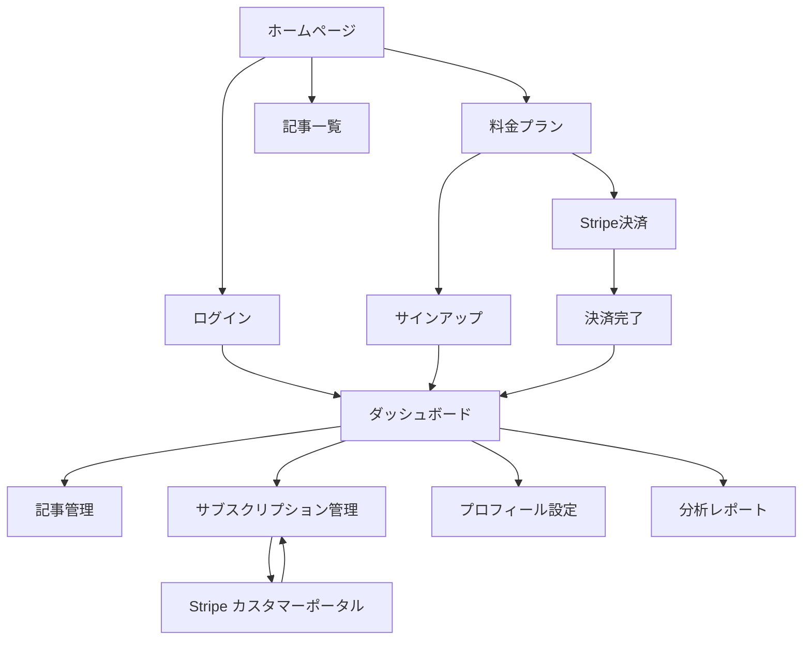

# AICA-SyS (AI-driven Content Curation & Automated Sales System)

## プロジェクト概要

AI 駆動型 ニッチ情報キュレーション＆自動販売システム (AICA-SyS) は、TypeScript エコシステム特化型の AI 自動コンテンツ生成・販売システムです。

### 目標

- 3-6 ヶ月で月額 1 万円以上の収益化
- TypeScript エコシステムの最新動向を自動収集・分析・要約
- 高品質なコンテンツ（ブログ記事、ニュースレター、電子書籍）の自動生成・販売

### 技術スタック

- **フロントエンド**: Next.js 14 (TypeScript)
- **バックエンド**: Python FastAPI + Next.js API Routes
- **AI**: Google AI Studio (Gemini Pro)
- **データベース**: PostgreSQL + Qdrant (ベクトル DB)
- **インフラ**: Vercel + GCP Cloud Functions

## プロジェクト構造

```
aica-sys/
├── frontend/          # Next.js アプリケーション
├── backend/           # Python AI エージェント
├── shared/            # 共通型定義・ユーティリティ
├── docs/              # ドキュメント
├── scripts/           # デプロイ・管理スクリプト
└── README.md
```

## 開発フェーズ

### Phase 1: 企画・設計・基盤構築 (2-3 週間)

- ニッチ市場分析と収益モデル設計
- システムアーキテクチャ設計
- 開発環境構築

### Phase 2: AI エージェントロジック開発 (3-4 週間)

- 情報収集エージェント
- 情報分析・要約エージェント
- コンテンツ自動生成エージェント

### Phase 3: プラットフォーム構築と販売システム (2-3 週間)

- コンテンツ公開システム
- 決済・サブスクリプションシステム
- モニタリング・通知システム

### Phase 4: テスト・改善・マーケティング (継続)

- システムテスト・品質改善
- マーケティング・拡散

## 収益モデル

- **月額サブスクリプション**: ¥1,980/月
- **プレミアムレポート販売**: ¥4,980/冊
- **アフィリエイト収益**: 開発ツール、書籍等

## サイトマップ

### 公開ページ

```
/ (ホーム)
├── /pricing (料金プラン)
├── /articles (記事一覧)
├── /newsletters (ニュースレター)
├── /trends (トレンド分析)
├── /about (会社概要)
├── /privacy (プライバシーポリシー)
└── /terms (利用規約)
```

### 認証ページ

```
/auth/
├── /signin (ログイン)
└── /signup (サインアップ)
```

### ダッシュボード（認証必須）

```
/dashboard/
├── / (メインダッシュボード)
├── /subscription (サブスクリプション管理)
├── /profile (プロフィール設定)
├── /articles (記事管理)
├── /newsletters (ニュースレター管理)
└── /analytics (分析レポート)
```

### API エンドポイント

```
/api/
├── /auth/[...nextauth] (NextAuth.js)
├── /stripe/
│   ├── /create-checkout-session
│   ├── /create-portal-session
│   └── /webhook
└── /content/ (コンテンツ管理API)
```

## 情報アーキテクチャ

### ユーザーフロー

```
1. ランディングページ訪問
   ↓
2. 料金プラン確認
   ↓
3. サインアップ/ログイン
   ↓
4. ダッシュボード
   ↓
5. コンテンツ閲覧・管理
   ↓
6. サブスクリプション管理
```

### コンテンツ階層

```
AICA-SyS
├── 記事 (Articles)
│   ├── 技術記事
│   ├── チュートリアル
│   └── ベストプラクティス
├── ニュースレター (Newsletters)
│   ├── 週間レポート
│   ├── 月間レポート
│   └── 特別レポート
└── トレンド分析 (Trends)
    ├── TypeScript 動向
    ├── フレームワーク動向
    └── ツール動向
```

### ユーザー権限

```
フリーユーザー:
- 基本記事の閲覧
- 週1回のトレンドレポート
- コミュニティアクセス

プレミアムユーザー:
- 全記事の閲覧
- 日次トレンドレポート
- プレミアムコンテンツ
- API アクセス
- カスタム分析

エンタープライズユーザー:
- 無制限アクセス
- チーム管理機能
- カスタムブランディング
- 専任サポート
```

## 画面遷移図



## デプロイ構成

### フロントエンド
- **プラットフォーム**: Vercel
- **プラン**: Hobby（無料）
- **URL**: https://aica-sys.vercel.app
- **機能**: Speed Insights、自動最適化

### バックエンド
- **プラットフォーム**: Render
- **プラン**: Free（無料、スリープあり）
- **URL**: https://aica-sys-backend.onrender.com
- **デプロイガイド**: [docs/render-deployment-guide.md](docs/render-deployment-guide.md)

### データベース
- **開発**: SQLite（ローカル）
- **本番**: Render PostgreSQL または Neon PostgreSQL
- **移行ガイド**: [docs/database-migration-options.md](docs/database-migration-options.md)

## セットアップ

詳細なセットアップ手順は各フェーズのドキュメントを参照してください。

### クイックスタート

```bash
# フロントエンド
cd frontend
npm install
npm run dev

# バックエンド
cd backend
python3 -m venv venv
source venv/bin/activate
pip install -r requirements.txt
python3 -m uvicorn main:app --reload

# データベース確認
make check-db
make db-status
```

## 作業終了時の自動 PR 作成・マージ手順

作業終了時には以下の手順を自動的に実施する：

1. `git status` で変更内容を確認
2. `git add .` で全変更をステージング
3. `git commit -m "feat: [作業内容の詳細説明]"` でコミット
4. `git push origin [ブランチ名]` でプッシュ
5. `gh pr create --title "[タイトル]" --body "[詳細説明]" --base main` で PR 作成
6. `gh pr merge [PR番号] --merge --delete-branch` で PR マージ
7. `git checkout main && git pull origin main` で main ブランチに切り替え・更新

## ライセンス

MIT License
