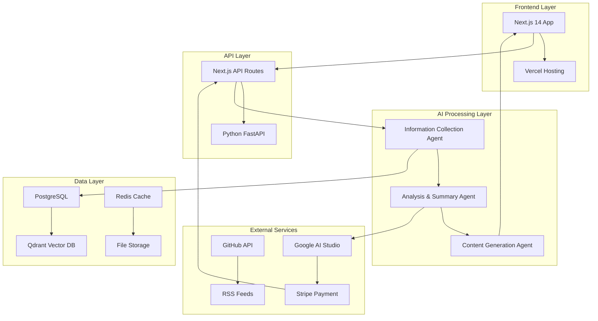

# Phase 1: 企画・設計・基盤構築

## 1.1 ニッチ市場分析と収益モデル設計

### TypeScript エコシステム市場調査

#### 主要フレームワーク動向

- **Next.js**: App Router、Server Components、Turbopack
- **SvelteKit**: 軽量性とパフォーマンス
- **Solid.js**: リアクティブプログラミング
- **Astro**: マルチフレームワーク対応
- **Remix**: データローディング最適化

#### ライブラリトレンド

- **状態管理**: Zustand、Jotai、Valtio
- **データフェッチ**: TanStack Query、SWR
- **フォーム**: React Hook Form、Formik
- **UI**: Radix UI、Headless UI、Chakra UI
- **スタイリング**: Tailwind CSS、Styled Components

#### ツールチェーン進化

- **ビルドツール**: Turbopack、Vite、esbuild
- **ランタイム**: Bun、Deno
- **リンター**: Biome、ESLint
- **フォーマッター**: Prettier、Biome
- **型チェック**: TypeScript、tsc

### 収益モデル設計

#### 月額サブスクリプション (¥1,980/月)

- 週刊 TypeScript トレンドレポート
- 月間フレームワーク比較分析
- 新機能・ライブラリの詳細解説
- コミュニティアクセス

#### プレミアムレポート販売 (¥4,980/冊)

- 年次 TypeScript エコシステム総括
- フレームワーク移行ガイド
- パフォーマンス最適化完全ガイド
- 企業導入事例研究

#### アフィリエイト収益

- 開発ツール (Vercel、Netlify、Railway)
- 書籍 (O'Reilly、Manning)
- オンラインコース (Udemy、Pluralsight)
- 開発者向けサービス

### ターゲットペルソナ

#### プライマリペルソナ: TypeScript 開発者 (中級〜上級)

- **年齢**: 25-40 歳
- **職種**: フロントエンドエンジニア、フルスタックエンジニア
- **経験**: 3-10 年の開発経験
- **課題**: 最新技術のキャッチアップ、技術選定の判断
- **ニーズ**: 効率的な学習、実践的な情報

#### セカンダリペルソナ: 技術リード・アーキテクト

- **年齢**: 30-45 歳
- **職種**: テックリード、アーキテクト、CTO
- **経験**: 5-15 年の開発経験
- **課題**: チームの技術戦略立案、技術選定
- **ニーズ**: 戦略的な技術情報、導入事例

## 1.2 システムアーキテクチャ設計

### 全体アーキテクチャ



### 技術スタック詳細

#### フロントエンド

- **Next.js 14**: App Router、Server Components
- **TypeScript**: 型安全性
- **Tailwind CSS**: スタイリング
- **Radix UI**: アクセシブルな UI コンポーネント
- **TanStack Query**: データフェッチ
- **NextAuth.js**: 認証

#### バックエンド

- **Next.js API Routes**: フロントエンド連携
- **Python FastAPI**: AI 処理・重い計算
- **PostgreSQL**: 構造化データ
- **Qdrant**: ベクトル検索・RAG
- **Redis**: キャッシュ・セッション

#### AI・ML

- **Google AI Studio (Gemini Pro)**: テキスト生成
- **OpenAI API**: バックアップ・比較
- **Stable Diffusion**: 画像生成
- **Sentence Transformers**: 埋め込み生成

#### インフラ

- **Vercel**: フロントエンド・API
- **GCP Cloud Functions**: Python 処理
- **Cloud Storage**: ファイル保存
- **Cloud SQL**: PostgreSQL
- **Cloud Run**: コンテナ実行

### データフロー設計

#### 1. 情報収集フロー

```
外部ソース → 収集エージェント → データ正規化 → PostgreSQL → ベクトル化 → Qdrant
```

#### 2. 分析・要約フロー

```
Qdrant → RAG検索 → Gemini API → 分析結果 → PostgreSQL
```

#### 3. コンテンツ生成フロー

```
分析結果 → プロンプト生成 → Gemini API → コンテンツ → 画像生成 → 公開
```

#### 4. 販売フロー

```
ユーザー → 認証 → 決済 → アクセス権限 → コンテンツ表示
```

### API 設計

#### RESTful API

```
GET    /api/content/articles          # 記事一覧
GET    /api/content/articles/:id      # 記事詳細
POST   /api/content/generate          # コンテンツ生成
GET    /api/trends                    # トレンド情報
POST   /api/subscription              # サブスクリプション
GET    /api/user/profile              # ユーザー情報
```

#### GraphQL (将来拡張)

```graphql
type Article {
  id: ID!
  title: String!
  content: String!
  publishedAt: DateTime!
  tags: [String!]!
}

type Query {
  articles(filter: ArticleFilter): [Article!]!
  trends: [Trend!]!
}
```

## 1.3 開発環境構築

### プロジェクト構造

```
aica-sys/
├── frontend/                 # Next.js アプリケーション
│   ├── src/
│   │   ├── app/             # App Router
│   │   ├── components/      # UIコンポーネント
│   │   ├── lib/             # ユーティリティ
│   │   └── types/           # 型定義
│   ├── package.json
│   └── next.config.js
├── backend/                  # Python AI エージェント
│   ├── agents/              # AIエージェント
│   ├── services/            # ビジネスロジック
│   ├── models/              # データモデル
│   ├── utils/               # ユーティリティ
│   ├── requirements.txt
│   └── main.py
├── shared/                   # 共通型定義・ユーティリティ
│   ├── types/               # 共通型定義
│   └── utils/               # 共通ユーティリティ
├── docs/                     # ドキュメント
├── scripts/                  # デプロイ・管理スクリプト
├── docker-compose.yml        # 開発環境
└── README.md
```

### 開発環境設定

#### フロントエンド (Next.js)

```json
{
  "name": "aica-sys-frontend",
  "version": "0.1.0",
  "private": true,
  "scripts": {
    "dev": "next dev",
    "build": "next build",
    "start": "next start",
    "lint": "next lint",
    "type-check": "tsc --noEmit"
  },
  "dependencies": {
    "next": "14.0.0",
    "react": "18.2.0",
    "react-dom": "18.2.0",
    "typescript": "5.2.0",
    "@types/node": "20.8.0",
    "@types/react": "18.2.0",
    "@types/react-dom": "18.2.0"
  }
}
```

#### バックエンド (Python)

```txt
fastapi==0.104.0
uvicorn==0.24.0
pydantic==2.4.0
sqlalchemy==2.0.0
alembic==1.12.0
psycopg2-binary==2.9.0
redis==5.0.0
google-generativeai==0.3.0
openai==1.3.0
requests==2.31.0
beautifulsoup4==4.12.0
scrapy==2.11.0
qdrant-client==1.6.0
sentence-transformers==2.2.0
```

### CI/CD 設定

#### GitHub Actions

```yaml
name: CI/CD Pipeline

on:
  push:
    branches: [main, develop]
  pull_request:
    branches: [main]

jobs:
  frontend-test:
    runs-on: ubuntu-latest
    steps:
      - uses: actions/checkout@v4
      - uses: actions/setup-node@v4
        with:
          node-version: '18'
      - run: cd frontend && npm ci
      - run: cd frontend && npm run lint
      - run: cd frontend && npm run type-check
      - run: cd frontend && npm run build

  backend-test:
    runs-on: ubuntu-latest
    steps:
      - uses: actions/checkout@v4
      - uses: actions/setup-python@v4
        with:
          python-version: '3.11'
      - run: cd backend && pip install -r requirements.txt
      - run: cd backend && python -m pytest

  deploy:
    needs: [frontend-test, backend-test]
    runs-on: ubuntu-latest
    if: github.ref == 'refs/heads/main'
    steps:
      - uses: actions/checkout@v4
      - run: echo "Deploy to production"
```

## 次のステップ

1. フロントエンド環境構築
2. バックエンド環境構築
3. データベース設計・構築
4. 基本的な API 実装
5. 認証システム実装
